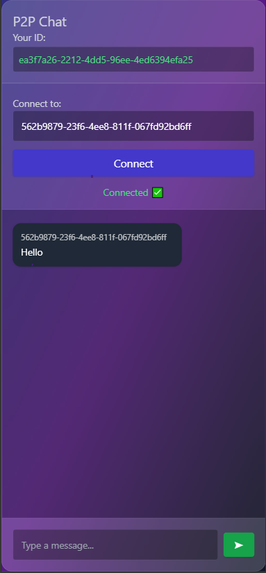

# P2P Chat Application



This project is a real-time peer-to-peer (P2P) chat application. This application allows users to exchange messages via WebSocket.

## Technologies

- **Node.js**: For server-side
- **Express**: To create the HTTP server
- **WebSocket**: For real-time communication
- **HTML/CSS**: For the user interface

## Installation

1. **Install Node.js and NPM**. You can download it from the [official Node.js website](https://nodejs.org/).

2. **Clone the project**:

   ```bash
   git clone https://github.com/YOUR_GITHUB_USERNAME/p2p-chat.git
   cd p2p-chat
   ```

   > Please replace `YOUR_GITHUB_USERNAME` with your actual GitHub username.

3. **Install the required packages**:

   ```bash
   npm install
   ```

4. **Start the server**:

   ```bash
   node index.js
   ```

   The server will run on port 3000.

5. **Open in the browser**:

   Open your browser and go to `index.html`. This will display your chat application.

## How it Works

- **WebSocket** provides real-time communication between users.
- Each user is assigned a `userId` (UUID) when connecting.
- When a user sends a message to another user, the message is delivered directly to the intended recipient.

## Authors

- Your Name (replace with your actual name or GitHub profile link)

## License

This project is licensed under the [MIT License](LICENSE).
